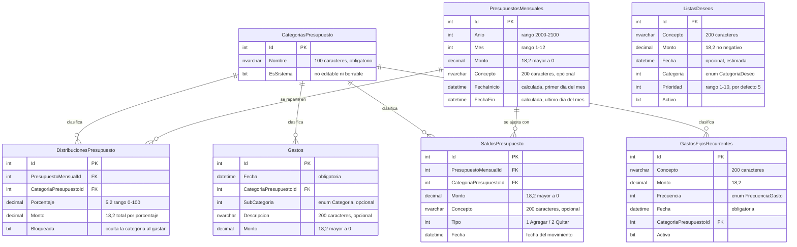

# AGENTS.md — Brief de diseño de "Control de Gastos" (Presupuesto)

Documento de referencia funcional y de datos para diseñar la interfaz completa de la aplicación en **Google Stitch** (u otra herramienta de diseño). Describe **qué hace cada pantalla, qué contiene, cómo se comporta y qué datos maneja**. No contiene código ni referencias a la estructura interna del proyecto.

> **Empieza por la sección 0**: contiene el prompt maestro y los prompts por pantalla ya consolidados y listos para pegar en Stitch. Las secciones 1 a 9 son el detalle de respaldo: úsalas para resolver dudas, ampliar un prompt o verificar que no falte nada.

---

## 0. Prompt consolidado para Stitch (copiar y pegar)

Esta sección es **lo que se pega en Stitch**. El resto del documento (secciones 1 a 9) es la referencia de detalle para resolver dudas o refinar.

**Cómo usarla**
1. Crear el proyecto y pegar primero el **prompt maestro (0.1)**: fija identidad visual, paleta y componentes.
2. Generar **una pantalla por prompt** de la sección 0.2, en el orden indicado. No pegar todas juntas.
3. Refinar con las **frases de ajuste (0.3)** sobre la pantalla ya generada.
4. Todos los prompts exigen **textos en español**; si Stitch devuelve algo en inglés, usar la frase de corrección de 0.3.

---

### 0.1 Prompt maestro (pegar primero)

```
Diseña una aplicación web responsive de finanzas personales llamada "Control de Gastos",
en español (todos los textos, etiquetas y botones en español, sin una sola palabra en inglés).
Es de uso personal: no hay login, ni perfiles, ni equipo.

Estilo: dashboard financiero limpio y moderno, tema claro, fondo gris muy suave,
contenido en tarjetas blancas con esquinas redondeadas y sombra sutil, mucho espacio en blanco,
tipografía sans-serif legible, iconos de línea finos.

Layout: barra lateral fija oscura a la izquierda con el logo de una billetera y el texto
"Control de Gastos", y estos enlaces con icono: Inicio, Mis Gastos, Nuevo Gasto, Resumen,
Presupuesto Mensual, Categorías, Gastos Fijos, Lista de Deseos. El contenido va a la derecha,
con un encabezado de página que lleva icono, título grande y el botón de acción principal
alineado a la derecha.

Colores: azul #0d6efd para acciones principales e importes destacados, verde #198754 para
totales y estado correcto, ámbar #ffc107 para advertencias, rojo #dc3545 para eliminar y
sobregiro, celeste #0dcaf0 para información, gris #6c757d para texto secundario.
Paleta para categorías (un color fijo por categoría, siempre el mismo en tablas y gráficas):
#4A90E2, #E27D60, #F3B562, #C38D9E, #41B3A3, #85CDCB, #E8A87C, #F06060, #5C8374, #9B786F,
#7E909A, #A593E0.

Moneda: pesos, siempre sin decimales, con separador de miles con punto y prefijo $
(ejemplos: $ 45.000, $ 1.250.000). Fechas en formato dd/MM/yyyy y meses escritos en español.

Componentes reutilizables: tarjeta contenedora con encabezado; tarjeta de indicador con fondo
de color sólido, texto blanco, etiqueta en mayúsculas pequeñas, cifra grande e icono grande
semitransparente a la derecha; barra de filtros; tabla con encabezado tenue, filas con hover,
botones-icono de editar (lápiz azul) y eliminar (papelera roja) a la derecha y fila de total al
pie; badges de categoría en forma de píldora; badges de estado Activo (verde) e Inactivo (rojo);
paginación de 10 registros con el texto "Mostrando X de Y registros"; modales de confirmación
centrados; estados vacíos con icono grande, título y frase de ayuda; spinner de carga.

Responsive: en pantallas menores a 768px las tablas NO hacen scroll horizontal, se convierten en
tarjetas apiladas (badge de categoría y fecha arriba, descripción en medio, monto grande y
botones de acción abajo) y la lista termina con una tarjeta de total. El menú lateral se colapsa
en un botón hamburguesa y los filtros pasan a una sola columna.
```

---

### 0.2 Prompts por pantalla (uno a uno, en este orden)

**1. Inicio**
```
Pantalla de Inicio de "Control de Gastos". Encabezado centrado con icono de billetera, título
grande "Control de Gastos" y subtítulo "Administra tus finanzas personales de manera sencilla".
Debajo, una rejilla de 6 tarjetas iguales (3 por fila en escritorio, 1 por fila en móvil), cada
una con un círculo de color tenue con icono grande, título, frase descriptiva y un botón de
ancho completo abajo:
- "Ver Gastos" azul, "Consulta y administra todos tus gastos registrados.", botón "Ir a Gastos".
- "Nuevo Gasto" verde, "Registra un nuevo gasto de forma rápida y sencilla.", botón "Agregar".
- "Presupuestos" ámbar, "Define tu presupuesto mensual y distribuye tus fondos.", botón "Ver Presupuestos".
- "Resumen" celeste, "Visualiza el resumen mensual de tus gastos.", botón "Ver Resumen".
- "Gastos Fijos" gris, "Administra tus pagos regulares y suscripciones.", botón "Ver Gastos Fijos".
- "Lista de Deseos" rojo, "Gestiona tus metas de compras y caprichos.", botón "Ver Deseos".
Todas las tarjetas con la misma altura y elevación al pasar el cursor.
```

**2. Mis Gastos (listado)**
```
Pantalla "Mis Gastos". Encabezado con icono de billetera, título "Mis Gastos" y botón azul
"Nuevo Gasto" a la derecha.
Tarjeta de filtros con seis controles en línea, cada uno con su etiqueta encima: Año, Mes,
Categoría, Fecha Inicio, Fecha Fin y un botón "Limpiar". No hay botón de buscar: los filtros se
aplican solos.
Debajo, tarjeta con una tabla: Fecha, Categoría, Descripción, Monto (a la derecha, en negrita) y
Acciones (botones de editar y eliminar). Ejemplos de filas: "12/08/2026 · Gastos Básicos ·
Compras en supermercado · $ 145.000", "11/08/2026 · Gastos Fijos · Pago de Internet · $ 89.900",
"10/08/2026 · Gastos Personales · Almuerzo · $ 23.000". Cada categoría con su badge de color.
Fila de pie con "Total:" y $ 1.284.500 en verde.
Abajo a la izquierda "Mostrando 10 de 34 registros" y a la derecha paginación
Anterior / 1 2 3 / Siguiente.
Incluye también la versión móvil de esta pantalla con las filas convertidas en tarjetas apiladas
y una tarjeta final de total.
```

**3. Nuevo Gasto (prioridad máxima, diseñar primero en móvil)**
```
Formulario "Nuevo Gasto" dentro de una tarjeta centrada con encabezado azul e icono de más.
Campos en este orden:
1. "Fecha": selector de fecha.
2. "Categoría": desplegable con Gastos Básicos, Gastos Personales, Inversiones, Gastos Fijos, Otros.
3. Un recuadro informativo con borde azul a la izquierda que dice "Disponible en categoría:" y a la
   derecha "$ 320.000" en azul y negrita; debajo, una banda ámbar con icono de advertencia:
   "Valor máximo a gastar por día recomendado: $ 16.000".
4. "Descripción (Opcional)": campo de texto con el marcador "Ej: Compras en supermercado".
5. "Montos Rápidos": rejilla de cinco tarjetas ilustradas con forma de billete, cada una de un
   color distinto, con el símbolo $ y la cifra en grande y la palabra "COP" abajo, para
   5.000, 10.000, 20.000, 50.000 y 100.000. El billete de 20.000 aparece seleccionado, con borde
   resaltado y un check en la esquina.
6. "Monto": campo grande con un botón "−" a la izquierda, el prefijo $, la cifra 20.000 centrada
   en azul y negrita, y un botón "+" a la derecha.
Al final, botón azul "Guardar Gasto" y botón de contorno gris "Cancelar".
Los billetes son el elemento visual protagonista: deben verse atractivos y táctiles.
```

**4. Resumen Mensual — parte superior**
```
Pantalla "Resumen Mensual" con icono de gráfica en el título. Debajo, una tarjeta estrecha con
dos desplegables, Año y Mes.
Fila de tres tarjetas de indicador de la misma altura:
- Azul, etiqueta "TOTAL DEL MES", cifra "$ 1.284.500", icono de monedas.
- Celeste, etiqueta "PERÍODO", texto "Agosto", icono de calendario.
- Blanca, con un medidor semicircular tipo velocímetro que marca 72% en verde, con el número
  grande en el centro y la leyenda "del presupuesto".
Debajo, dos tarjetas lado a lado de la misma altura:
- Izquierda "Gastos por Categoría": gráfica de dona con leyenda inferior, un color por categoría.
- Derecha "Desglose por Categoría": tabla con Categoría (badge), Cantidad, Total y %, con fila de
  totales al pie.
```

**5. Resumen Mensual — parte inferior**
```
Continuación de la pantalla "Resumen Mensual", cuatro tarjetas apiladas a todo el ancho:
1. "Presupuesto vs Gasto Real": gráfica de barras horizontales con dos series por categoría,
   "Presupuestado" y "Gastado". Debajo, una fila de cuatro mini tarjetas de estado, una por
   categoría, cada una con el nombre, un icono de semáforo, una barra de progreso y el texto
   "$ 420.000   85% de $ 500.000". Verde si va bien, ámbar por encima del 80%, rojo por encima
   del 100%.
2. "Gastos por Día": gráfica de barras verticales celestes, una por día del mes.
3. "Evolución Mensual de Gastos": gráfica de línea con área azul de los últimos 6 meses, con un
   badge "Últimos 6 meses" en el encabezado.
4. "Categorías en el Tiempo": gráfica de barras apiladas de los últimos 6 meses, una serie por
   categoría con su color fijo.
Los ejes abrevian los importes grandes como $250k y $1.2M.
```

**6. Presupuesto Mensual (listado)**
```
Pantalla "Presupuesto Mensual" con botón azul "Nuevo Presupuesto".
Tarjeta de filtros: Año, Mes, un campo de búsqueda con icono de lupa y el marcador
"Ej: Ahorro, Arriendo..." y un botón "Limpiar".
Tabla con columnas Año, Mes, Presupuesto, Saldo Actual, Concepto y Acciones. El Saldo Actual se
colorea: verde cuando está por encima del presupuesto, ámbar cuando es menor, rojo cuando llega a
cero. Las filas de acciones tienen tres botones circulares pequeños: uno verde con el símbolo ±
("Ajustar saldo"), uno azul de editar y uno rojo de eliminar.
Ejemplos: "2026 · Agosto · $ 2.000.000 · $ 2.150.000 · Sueldo mensual",
"2026 · Julio · $ 2.000.000 · $ 1.740.000 · Sin concepto" (este último en gris cursiva).
Debajo de la tabla, el texto "Total: 8 registro(s)".
```

**7. Modal Ajustar Saldo**
```
Ventana modal ancha titulada "Ajustar Saldo" con icono de más y menos, sobre la pantalla de
presupuestos atenuada.
Arriba, el subtítulo "Movimientos anteriores" y una tabla compacta con Fecha, Tipo, Categoría,
Monto, Concepto y un botón rojo pequeño para quitar. El Tipo se muestra como badge verde
"Agregar" o rojo "Quitar".
Abajo, el subtítulo "Nuevo movimiento" y un formulario en dos filas de dos columnas: Categoría,
Tipo, Monto (con prefijo $) y Concepto. Los campos obligatorios llevan un asterisco rojo.
Al final, botón verde "Guardar movimiento" y botón de contorno "Cerrar".
Diseña también el modal de confirmación que aparece después: encabezado ámbar con icono de
advertencia y el título "Atención", el texto "¿Confirmar ajuste de saldo?" y un recuadro celeste
que dice "Este cambio afectará los valores de la distribución mensual y recalculará los
porcentajes automáticamente", con botones "Cancelar" y "Confirmar y Guardar".
```

**8. Nuevo Presupuesto Mensual**
```
Formulario "Nuevo Presupuesto Mensual" en una tarjeta centrada, con un enlace "Volver al listado"
arriba. Primera fila: "Año" como campo de solo lectura con fondo gris y la nota "El año se
establece automáticamente", y "Mes" como desplegable. Después "Monto Total" con prefijo $ y
"Concepto (opcional)" con un contador "24/200" alineado a la derecha.
Debajo, un bloque destacado con fondo gris claro titulado "Distribución del Presupuesto por
Categoría", que contiene una tabla con columnas: Categoría (desplegable), Porcentaje (%) (campo
numérico con sufijo %), Monto Calculado (campo de solo lectura), "Bloq." (interruptor) y un botón
rojo de eliminar fila. La primera fila es la categoría de sistema y aparece sin desplegable, sin
interruptor y sin botón de eliminar.
La fila TOTAL al pie está resaltada en verde y muestra "TOTAL · 100 % · $ 2.000.000".
Debajo de la tabla, un botón de contorno azul "Agregar Categoría".
Muestra también una variante donde el total suma 90%: la fila TOTAL se pone ámbar y aparece un
aviso ámbar con la lista de errores, empezando por "La suma de los porcentajes debe ser
exactamente 100% (Actual: 90%)", y el botón "Guardar Presupuesto" se ve deshabilitado.
```

**9. Categorías**
```
Pantalla "Categorías de Presupuesto": una sola tarjeta con encabezado azul, icono de etiquetas,
título y un botón claro "Nueva Categoría" a la derecha. Dentro, una tabla sencilla con las
columnas Nombre y Acciones. Filas: "Gastos Básicos" (sin ningún botón de acción, es categoría de
sistema), "Gastos Fijos", "Gastos Personales", "Inversiones" y "Otros", estas con botones de
editar y eliminar.
Añade el modal de confirmación con encabezado rojo, el texto "¿Estás seguro que deseas eliminar
la categoría Inversiones?" y, dentro del propio modal, una banda roja de error que dice "No se
puede eliminar la categoría porque hay gastos asociados a ella".
Diseña también el formulario de categoría: tarjeta estrecha con encabezado azul "Nueva
Categoría", un único campo "Nombre de Categoría" con el marcador "Ej: Transporte, Cuidado
Personal", y los botones "Guardar" y "Cancelar".
```

**10. Gastos Fijos**
```
Pantalla "Gastos Fijos" con subtítulo "Administración de conceptos recurrentes" y botón azul
"Nuevo Gasto Fijo". Tabla con columnas Concepto, Monto, Frecuencia, Fecha, Categoría, Estado y
Acciones. La Frecuencia es un badge de color según el valor: Mensual celeste, Trimestral ámbar,
Semestral azul, Anual gris. El Estado es un badge "Activo" verde suave o "Inactivo" rojo suave.
Ejemplos: "Pago de Internet · $ 89.900 · Mensual", "Seguro del auto · $ 420.000 · Semestral",
"Suscripción de música · $ 16.900 · Mensual".
Fila de pie con "Total:" y la suma de los activos en verde. Paginación abajo.
Diseña también el formulario: tarjeta centrada con los campos Concepto, Monto y Frecuencia,
Fecha, y un interruptor "Activo" encendido; sin campo de categoría.
Incluye el estado vacío: icono grande de calendario tachado, "No hay gastos fijos registrados" y
la frase "Agrega conceptos recurrentes para usarlos en el registro de gastos."
```

**11. Lista de Deseos**
```
Pantalla "Lista de Deseos" con subtítulo "Gestiona tus metas de compras" y botón azul "Nuevo
Deseo". Tabla con columnas Concepto, Monto, Fecha Estimada, Categoría, Prioridad, Estado y
Acciones. La Prioridad es un badge circular con el número del 1 al 10 y color según el nivel:
rojo para 9 y 10, ámbar para 7 y 8, celeste para 5 y 6, gris para los menores.
Ejemplos: "Audífonos Bluetooth · $ 350.000 · Tecnología · 9", "Silla ergonómica · $ 890.000 ·
Hogar · 6", "Curso de inglés · $ 1.200.000 · Personales · 4".
Diseña también el formulario: Concepto, Monto, Fecha Estimada (Opcional), Categoría, y
"Prioridad (1-10)" como control deslizante con el badge de color a la derecha mostrando el valor,
más un interruptor "Activo".
```

**12. Hoja de estados y componentes**
```
Una lámina de sistema de diseño para "Control de Gastos" que muestre juntos, sobre fondo claro:
la tarjeta de indicador en sus cuatro colores; los badges de categoría en los doce colores de la
paleta; los badges de estado Activo e Inactivo; los badges de prioridad del 1 al 10; el bloque de
paginación con "Mostrando 10 de 34 registros"; el estado de carga con spinner y el texto
"Cargando..."; tres estados vacíos con icono grande, título y frase de ayuda; las bandas de
alerta roja, ámbar y celeste; el campo de monto con botones − y +; el interruptor; y los botones
primario, secundario y de peligro en sus estados normal, hover y deshabilitado.
Todos los textos en español.
```

---

### 0.3 Frases de ajuste (para refinar lo generado)

- `Traduce toda la interfaz al español, sin dejar ninguna palabra en inglés.`
- `Quita los decimales de todos los importes y usa el punto como separador de miles.`
- `Convierte la tabla en tarjetas apiladas para la versión móvil, sin scroll horizontal.`
- `Unifica el estilo de todos los botones: mismo radio de esquina en todas las pantallas.`
- `Aumenta el espacio en blanco entre las tarjetas y reduce el peso de las sombras.`
- `Usa el mismo color para la misma categoría en la tabla y en la gráfica.`
- `Muestra el estado deshabilitado del botón principal cuando la validación no se cumple.`
- `Haz los billetes de montos rápidos más grandes y con más contraste entre denominaciones.`

---

## 1. El producto en una frase

Aplicación personal de **control de gastos y presupuesto mensual**: el usuario define cuánto dinero tiene disponible cada mes, lo reparte por categorías en porcentajes, registra sus gastos diarios contra ese reparto y visualiza en gráficas cuánto ha consumido de cada bolsillo. Se complementa con la administración de **gastos fijos recurrentes** y una **lista de deseos** priorizada.

- **Usuario**: una sola persona (no hay inicio de sesión, ni roles, ni multiusuario). Todo lo que ve es suyo.
- **Idioma**: 100% español (títulos, etiquetas, botones, validaciones, meses, nombres de categorías).
- **Moneda**: peso, formato **sin decimales**, separador de miles con punto y prefijo `$` (ejemplos: `$ 5.000`, `$ 1.250.000`). Las etiquetas de los "billetes" muestran el texto `COP`. *(La versión actual es inconsistente —algunas tablas muestran decimales y otras no—; el diseño unifica todo sin decimales: ver sección 8.)*
- **Fechas**: formato `dd/MM/yyyy`. Meses siempre escritos en español (Enero … Diciembre).
- **Uso principal**: escritorio, pero **el móvil es de uso frecuente** para registrar gastos rápidamente. El diseño debe ser responsive de verdad, no solo "que quepa".

---

## 2. Sistema de diseño

### 2.1 Estilo general
- Estética **limpia, tipo dashboard financiero**: fondo claro neutro, contenido dentro de **tarjetas blancas con esquinas redondeadas y sombra suave**, mucho aire entre bloques.
- Jerarquía por tarjetas: cada bloque funcional (filtros, tabla, gráfica, formulario) vive en su propia tarjeta con encabezado y cuerpo.
- Encabezados de pantalla grandes, con **un icono a la izquierda del título** y el botón de acción principal alineado a la derecha en la misma fila.
- Botones: acción primaria en azul sólido; secundarios como contorno gris; destructivos en rojo (contorno dentro de tablas, sólido dentro de modales). En los módulos de Gastos Fijos y Lista de Deseos los botones son **tipo píldora** (muy redondeados) y en el resto son redondeados normales; unificar ese criterio en el rediseño es deseable.

### 2.2 Paleta funcional

| Uso | Color |
| --- | --- |
| Primario / acciones y montos destacados | Azul (`#0d6efd` aprox.) |
| Éxito / totales / estado "dentro del presupuesto" | Verde (`#198754`) |
| Advertencia / consumo alto / modo edición | Ámbar (`#ffc107`) |
| Peligro / eliminar / sobregiro | Rojo (`#dc3545`) |
| Información / periodo / gráficas secundarias | Celeste (`#0dcaf0`) |
| Neutro / textos secundarios | Gris (`#6c757d`) |

**Paleta de 12 colores para categorías.** Se asigna un color fijo a cada categoría y **siempre es el mismo en toda la aplicación**: badges de tablas, sectores de la dona, series de las barras apiladas. La asignación se hace **recorriendo las categorías en orden de creación**, de modo que una categoría conserva su color aunque cambie el orden en que se muestra; al agregar categorías nuevas se sigue por la paleta y se vuelve a empezar tras la duodécima.

`#4A90E2` azul suave · `#E27D60` coral · `#F3B562` dorado · `#C38D9E` rosa polvo · `#41B3A3` verde menta · `#85CDCB` azul claro · `#E8A87C` melocotón · `#F06060` rojo apagado · `#5C8374` verde salvia · `#9B786F` malva · `#7E909A` gris azulado · `#A593E0` púrpura suave.

### 2.3 Componentes recurrentes que hay que diseñar

1. **Tarjeta contenedora**, con y sin encabezado de color.
2. **Tarjeta KPI**: fondo de color sólido, texto blanco, etiqueta en mayúsculas pequeñas arriba, cifra grande abajo, icono grande semitransparente a la derecha.
3. **Barra de filtros**: fila de selectores y campos con etiqueta encima y un botón "Limpiar" al final.
4. **Tabla de datos**: encabezado con fondo tenue (oscuro en el listado de gastos), filas con hover, columna de acciones a la derecha con botones-icono cuadrados (lápiz azul = editar, papelera roja = eliminar) y **fila de pie con el total** destacado en verde.
5. **Tarjeta-registro móvil**: el equivalente de una fila de tabla cuando la pantalla es angosta (ver 2.5).
6. **Paginación**: 10 registros por página, controles "Anterior / 1 2 3 / Siguiente" abajo a la derecha y el texto "Mostrando X de Y registros" abajo a la izquierda.
7. **Badge de categoría**: píldora de color según la paleta de categorías.
8. **Badge de estado**: "Activo" (verde suave con borde) / "Inactivo" (rojo suave con borde).
9. **Modal de confirmación**: centrado, con encabezado de color según la gravedad (rojo para eliminar, ámbar para advertencia), mensaje corto, a veces un recuadro informativo explicando la consecuencia, y botones "Cancelar" / acción.
10. **Estado de carga**: spinner centrado con el texto "Cargando...".
11. **Estado vacío**: icono grande gris centrado + título + frase de ayuda (por ejemplo bandeja vacía y "No hay gastos registrados").
12. **Alertas en formulario**: banda roja con icono de advertencia para errores de guardado; banda ámbar para avisos de validación; banda celeste para información.
13. **Campo de monto**: grupo de entrada con `$` a la izquierda, texto en negrita centrado, formateo automático de miles mientras se escribe y solo admite dígitos.
14. **Interruptor (switch)** para banderas booleanas ("Activo", "Bloq.").

### 2.4 Iconografía

Set de iconos de línea. Asociaciones actuales: billetera = marca e inicio, lista = gastos, círculo con más = nuevo, gráfica ascendente = resumen, calendario con check = presupuesto mensual, etiquetas = categorías, calendario de rango = gastos fijos, estrella = lista de deseos, lápiz = editar, papelera = eliminar, símbolo `±` = ajustar saldo.

### 2.5 Responsive (regla clave del producto)

- **Escritorio (≥768px)**: tablas clásicas.
- **Móvil (<768px)**: **las tablas se reemplazan por tarjetas apiladas**, no por scroll horizontal. Cada tarjeta muestra la misma información reorganizada:
  - Fila superior: badge de categoría a la izquierda, fecha con icono de calendario a la derecha.
  - Centro: descripción del registro.
  - Fila inferior: monto en grande a la izquierda, botones editar/eliminar a la derecha.
  - Al final de la lista, una **tarjeta de total**: "Total (N gastos)" con el importe en verde.
- El menú lateral se colapsa en un botón hamburguesa y los filtros pasan a una sola columna.

---

## 3. Navegación global

Layout de dos zonas: **barra lateral fija a la izquierda** (oscura) y área de contenido a la derecha.

- Cabecera de la barra lateral: icono de billetera + marca **"Control de Gastos"**.
- Entradas del menú, en este orden: **Inicio · Mis Gastos · Nuevo Gasto · Resumen · Presupuesto Mensual · Categorías · Gastos Fijos · Lista de Deseos**. Cada una con su icono y con estado activo resaltado.
- El título del navegador cambia por pantalla y siempre lleva el sufijo "Control de Presupuesto".

---

## 4. Pantallas

### 4.1 Inicio (dashboard de acceso)

Portada de bienvenida, **sin datos ni cifras**: solo accesos.

- Encabezado centrado: icono de billetera, título grande "Control de Gastos" y subtítulo "Administra tus finanzas personales de manera sencilla".
- Rejilla de **6 tarjetas** (3 por fila en escritorio, 2 en tablet, 1 en móvil). Cada tarjeta lleva un círculo de color tenue con icono grande, un título, una frase descriptiva y un botón de ancho completo abajo; todas con la misma altura:
  1. **Ver Gastos** (azul) — "Consulta y administra todos tus gastos registrados."
  2. **Nuevo Gasto** (verde) — "Registra un nuevo gasto de forma rápida y sencilla."
  3. **Presupuestos** (ámbar) — "Define tu presupuesto mensual y distribuye tus fondos."
  4. **Resumen** (celeste) — "Visualiza el resumen mensual de tus gastos."
  5. **Gastos Fijos** (gris) — "Administra tus pagos regulares y suscripciones."
  6. **Lista de Deseos** (rojo) — "Gestiona tus metas de compras y caprichos."
- Efecto hover: elevación de la tarjeta.
- **Categorías no tiene tarjeta en esta pantalla** (solo se llega desde el menú lateral). Si se rediseña la Home, conviene darle acceso.

> Oportunidad de rediseño: esta pantalla podría convertirse en un dashboard real con los indicadores del mes en curso (gasto total, presupuesto restante, porcentaje consumido, próximos gastos fijos). Diseñar ambas variantes es bienvenido.

### 4.2 Mis Gastos (listado)

- Encabezado: "Mis Gastos" y botón primario "Nuevo Gasto".
- **Tarjeta de filtros** con 6 controles en línea: *Año* (año actual y 5 anteriores, opción "Todos"), *Mes* (nombres en español, "Todos"), *Categoría* (subcategorías: Alimentación, Transporte, Servicios, Vivienda, Otros; "Todas"), *Fecha Inicio*, *Fecha Fin* y botón "Limpiar". Los filtros se aplican **automáticamente al cambiar cualquiera de ellos**, no hay botón "Buscar". Al entrar vienen preseleccionados el año y el mes actuales, y ambas fechas en el día de hoy.
- **Tabla** con columnas: Fecha · Categoría (badge de color) · Descripción · Monto (a la derecha, en negrita) · Acciones. Pie de tabla con **"Total:"** y la suma de **todos los registros filtrados** (no solo los de la página visible), en verde.
  - El badge muestra la **subcategoría cuando el gasto tiene una**; si no, el nombre de la categoría de presupuesto.
- Paginación de 10 en 10.
- En móvil, tarjetas apiladas según la regla 2.5.
- Estado vacío: "No hay gastos registrados".
- Eliminar abre un **modal de confirmación**: "¿Está seguro de eliminar este gasto?" con Cancelar / Eliminar.

### 4.3 Nuevo Gasto / Editar Gasto (formulario)

Formulario dentro de una tarjeta estrecha centrada (encabezado azul al crear, ámbar al editar). Es **la pantalla más usada de la aplicación y la que más cuidado necesita en el diseño**.

Campos y comportamientos, en orden:

1. **Fecha** — selector de fecha, por defecto hoy. Al cambiarla se recalculan las categorías disponibles y el saldo disponible del mes correspondiente.
2. **Categoría** — desplegable con las categorías de presupuesto. **Solo aparecen las categorías no bloqueadas** en el presupuesto de ese mes. Si se elige la categoría de sistema, aparece debajo un segundo desplegable opcional de subcategoría (Alimentación, Transporte, Servicios, Vivienda, Otros).
3. **Panel "Disponible en categoría"** — recuadro informativo que aparece al elegir categoría, con borde lateral de color:
   - Muestra el importe disponible en esa categoría para ese mes (en azul), o el disponible agotado en rojo, o el texto "Sin presupuesto asignado" en ámbar.
   - Mientras consulta muestra un spinner pequeño.
   - Si hay disponible, añade una banda ámbar: *"Valor máximo a gastar por día recomendado: $ X"* (disponible dividido entre los días que quedan del mes). Hoy este aviso **solo existe al crear**; en el diseño debe aparecer también al editar.
   - Si no hay presupuesto, añade el aviso: *"Para este mes/año no existe o no tiene fondos para esta categoría."*
   - **Importante**: es informativo, **no bloquea el guardado**. Se puede registrar un gasto que exceda lo disponible.
4. **Descripción** — texto libre opcional (placeholder "Ej: Compras en supermercado"). **Excepción**: si la categoría seleccionada es la de gastos fijos, la descripción se convierte en un **desplegable de gastos fijos activos** y al elegir uno **se autocompleta el monto**.
5. **Montos Rápidos** — rejilla de **5 "billetes"** ilustrados y clicables: 5.000, 10.000, 20.000, 50.000 y 100.000. Cada billete tiene color propio por denominación, patrón de fondo, adornos en las cuatro esquinas, el símbolo `$` con la cifra en grande y la etiqueta `COP` abajo. El billete seleccionado se resalta y muestra un check. Al tocarlo **asigna** el monto, no lo acumula: elegir 20.000 y luego 50.000 deja 50.000. Es el elemento visual distintivo de la aplicación: debe verse atractivo y táctil.
6. **Monto** — campo grande con botón `−` a la izquierda y `+` a la derecha que restan y suman de 1.000 en 1.000 (el `−` se deshabilita por debajo de 1.000), prefijo `$`, texto azul en negrita centrado, solo dígitos y separador de miles automático.
7. **Alerta de error** si el guardado falla (por ejemplo, cuando no existe presupuesto del mes o la categoría no tiene distribución asignada).
8. **Botones**: "Guardar Gasto" (deshabilitado mientras no haya monto mayor a 0 y una categoría elegida; muestra spinner al guardar) y "Cancelar".

En modo edición la pantalla añade un estado de carga inicial y un aviso "Gasto no encontrado" con enlace de vuelta si el registro no existe.

### 4.4 Resumen Mensual

Pantalla analítica, de scroll largo. Arriba, una tarjeta con los selectores de **Año** y **Mes** que recarga todo el contenido.

Bloques, en orden:

1. **Tres tarjetas KPI**:
   - *Total del Mes* (azul, icono de monedas) con el gasto total.
   - *Período* (celeste, icono de calendario) con el nombre del mes.
   - *Medidor gauge* (semicírculo) con el **porcentaje del presupuesto consumido**: verde hasta 80%, ámbar entre 80% y 100%, rojo por encima de 100%; en el centro el porcentaje y debajo el texto "del presupuesto". Si no hay presupuesto del mes, muestra "Sin presupuesto".
2. **Gastos por Categoría** (media pantalla): gráfica de **dona** con leyenda inferior; el tooltip muestra importe y porcentaje.
3. **Desglose por Categoría** (media pantalla): tabla con Categoría (badge) · Cantidad de gastos · Total · % del mes, más fila de totales. En móvil se convierte en tarjetas con **barra de progreso horizontal** por categoría.
4. **Presupuesto vs Gasto Real**: gráfica de **barras horizontales agrupadas** (presupuestado frente a gastado, por categoría) con badge del periodo en el encabezado. Debajo, una rejilla de **mini tarjetas de estado** por categoría (4 por fila): nombre, icono de semáforo, barra de progreso y la leyenda "$ gastado — N% de $ presupuestado". Colores: verde hasta 80%, ámbar por encima de 80%, rojo por encima de 100%. Si no hay presupuesto del mes se muestra la alerta "No hay presupuesto configurado para este período."
5. **Gastos por Día**: gráfica de **barras verticales**, una por día con gasto ("Día 1", "Día 2"…).
6. **Evolución Mensual de Gastos**: gráfica de **línea con área** del total de los **últimos 6 meses**, con badge "Últimos 6 meses".
7. **Categorías en el Tiempo**: gráfica de **barras apiladas** de los últimos 6 meses, una serie por categoría con su color fijo.

Estado sin datos: alerta celeste "No hay datos para el período seleccionado."
Los ejes de las gráficas abrevian los importes grandes: `$1.2M`, `$250k`.

### 4.5 Presupuesto Mensual (listado)

- Encabezado "Presupuesto Mensual" y botón "Nuevo Presupuesto".
- **Filtros**: Año (desde el año próximo hasta 5 años atrás, con "Todos"), Mes ("Todos"), campo de búsqueda por concepto con icono de lupa (placeholder "Ej: Ahorro, Arriendo...") y botón "Limpiar". Filtrado automático al cambiar. Al entrar viene preseleccionado el año actual.
- **Tabla**: Año · Mes · Presupuesto · **Saldo Actual** · Concepto · Acciones.
  - El *Saldo Actual* se colorea: verde si es mayor o igual al presupuesto original, ámbar si es positivo pero menor, rojo si llega a cero o queda negativo.
  - Si no hay concepto se muestra "Sin concepto" en gris cursiva.
  - Tres botones de acción por fila: **`±` Ajustar saldo** (verde), **Editar** (azul) y **Eliminar** (rojo).
- Pie: "Total: N registro(s)".
- Estado vacío: "No se encontraron presupuestos."

**Modal "Ajustar Saldo"** (ancho, el más complejo de la aplicación):

- Sección superior **"Movimientos anteriores"**: tabla compacta con Fecha · Tipo (badge verde "Agregar" / rojo "Quitar") · Categoría (badge claro) · Monto · Concepto · botón para quitar el movimiento. Solo aparece si hay historial.
- Sección inferior **"Nuevo movimiento"** con cuatro campos en dos filas: *Categoría* (obligatoria, se marca en rojo mientras no se elija), *Tipo* (Agregar / Quitar), *Monto* (con `$` y formateo de miles) y *Concepto* (opcional, máximo 200 caracteres).
- Botones "Guardar movimiento" (verde) y "Cerrar".
- Al guardar aparece un **segundo modal de confirmación** con encabezado ámbar: "¿Confirmar ajuste de saldo?" con el aviso *"Este cambio afectará los valores de la distribución mensual y recalculará los porcentajes automáticamente."*
- Al quitar un movimiento del historial, otro modal con encabezado rojo: "¿Desea eliminar este movimiento del historial?" con el aviso de que se revertirá el impacto y se recalcularán los porcentajes.
- El modal para eliminar el presupuesto completo es aparte: encabezado rojo y el texto "¿Está seguro de eliminar este presupuesto? Esta acción no se puede deshacer."

### 4.6 Nuevo / Editar Presupuesto Mensual

Formulario centrado, con un enlace "Volver al listado" arriba.

- **Año**: campo numérico **de solo lectura**, fondo gris, con la nota "El año se establece automáticamente."
- **Mes**: desplegable obligatorio con los 12 meses.
- **Monto Total**: campo con `$`, solo dígitos y formateo de miles. Al cambiarlo se **recalculan en vivo todos los montos de la distribución**.
- **Concepto**: opcional, máximo 200 caracteres, con **contador `N/200`** alineado a la derecha.
- **Bloque "Distribución del Presupuesto por Categoría"** (recuadro gris con borde), el corazón de la pantalla:
  - Tabla con columnas: **Categoría** (desplegable por fila) · **Porcentaje (%)** (campo numérico de máximo 3 dígitos con sufijo `%`) · **Monto Calculado** (solo lectura, resultado de monto total × porcentaje) · **Bloq.** (interruptor) · botón para eliminar la fila.
  - La **categoría de sistema** aparece como fila fija: sin desplegable, sin interruptor y sin botón de eliminar. Se inicializa al 100%.
  - Botón "Agregar Categoría" debajo de la tabla, que añade una fila con la siguiente categoría no usada, al 0%.
  - **Fila TOTAL** en negrita al pie, con el porcentaje acumulado y la suma de montos. Se pinta de **verde cuando suma exactamente 100%** y de **ámbar cuando no**.
  - Panel de validación ámbar con la lista de problemas, visible mientras existan: *"La suma de los porcentajes debe ser exactamente 100% (Actual: X%)"*, *"No se permiten categorías duplicadas en la distribución"*, *"Toda distribución debe tener un porcentaje mayor a 0%"*.
  - El botón "Guardar Presupuesto" permanece **deshabilitado** hasta que la suma sea 100%, no haya categorías duplicadas ni filas en 0% y el monto total sea mayor a 0.
- El interruptor **"Bloq."** significa que esa categoría **no se ofrecerá al registrar gastos** de ese mes: queda reservada o congelada. No la exime de los recálculos que provocan los ajustes de saldo.
- Error posible al guardar: ya existe un presupuesto para ese mes y año.
- En modo edición, la pantalla añade estado de carga inicial y el aviso "No se encontró el presupuesto solicitado." si el registro no existe.

### 4.7 Categorías

- Tarjeta única con encabezado azul "Categorías de Presupuesto" y botón claro "Nueva Categoría" a la derecha.
- Tabla simple: **Nombre** · Acciones. Se listan primero las **categorías de sistema** y luego el resto en orden alfabético.
- Las categorías de sistema **no muestran botones de editar ni eliminar**: su celda de acciones queda vacía.
- Modal de eliminación con encabezado rojo: "¿Estás seguro que deseas eliminar la categoría **X**?". Si el borrado falla (por ser categoría de sistema o estar en uso), el error se muestra **dentro del mismo modal** en una banda roja.
- **Formulario de categoría** (crear y editar): tarjeta estrecha, enlace "Volver al listado", un único campo **Nombre** obligatorio (placeholder "Ej: Transporte, Cuidado Personal"), botones "Guardar" y "Cancelar", y alerta roja si el nombre ya existe.

### 4.8 Gastos Fijos

Conceptos recurrentes (suscripciones, arriendo, servicios) que luego se reutilizan al registrar un gasto.

- Encabezado: título "Gastos Fijos" con subtítulo "Administración de conceptos recurrentes" y botón píldora "Nuevo Gasto Fijo".
- **Tabla**: Concepto · Monto · **Frecuencia** (badge de color: Mensual = celeste, Trimestral = ámbar, Semestral = azul, Anual = gris) · Fecha · Categoría · **Estado** (Activo / Inactivo) · Acciones.
- Pie de tabla: **"Total:"** con la suma de los **gastos fijos activos**, en verde.
- Paginación de 10 en 10 y estado vacío con icono de calendario tachado: "No hay gastos fijos registrados — Agrega conceptos recurrentes para usarlos en el registro de gastos."
- Modal de confirmación de borrado con el concepto en negrita y botón que pasa a "Eliminando..." con spinner.
- **Formulario**: Concepto (placeholder "Ej: Pago de Internet"), Monto (`$` con formateo), Frecuencia (Mensual / Trimestral / Semestral / Anual), Fecha e interruptor "Activo" (encendido por defecto). La categoría **no se pide**: se asigna automáticamente a la categoría de gastos fijos.

### 4.9 Lista de Deseos

- Encabezado: "Lista de Deseos" con subtítulo "Gestiona tus metas de compras" y botón píldora "Nuevo Deseo".
- **Tabla**: Concepto · Monto · Fecha Estimada (o `—` si no tiene) · Categoría (badge píldora) · **Prioridad** · Estado · Acciones.
- **Prioridad**: número de 1 a 10 en badge circular, con color según el nivel — 9-10 rojo, 7-8 ámbar, 5-6 celeste, 3-4 gris, 1-2 gris claro con borde.
- Paginación de 10 en 10 y estado vacío con icono de estrella: "No hay deseos registrados — Agrega artículos o servicios que te gustaría adquirir."
- **Formulario**: Concepto (placeholder "Ej: Audífonos Bluetooth"), Monto, Fecha Estimada (opcional), Categoría (Tecnología, Personales, Salud, Hogar, Compras, Suscripciones, Transporte, Alimentos, Servicios, Otros), **Prioridad como control deslizante de 1 a 10** con el badge de color a la derecha mostrando el valor en vivo, e interruptor "Activo".

---

## 5. Reglas de negocio que impactan el diseño

1. **Un solo presupuesto por mes y año.** Intentar crear otro para el mismo periodo produce el error "Ya existe un presupuesto para {Mes} del {Año}".
2. **La distribución debe sumar exactamente 100%**, sin categorías repetidas ni filas en 0%. Hasta que se cumpla, el guardado está bloqueado.
3. **El monto de cada categoría es derivado**: monto total × porcentaje. Nunca se escribe a mano.
4. **Los ajustes de saldo recalculan todo**: al agregar o quitar saldo se modifica el monto total del presupuesto, el monto de la categoría afectada y **se recalculan los porcentajes de todas las categorías**. Eliminar un movimiento revierte exactamente ese efecto. Por eso ambas acciones piden confirmación explícita.
5. **Saldo Actual = monto del presupuesto + movimientos "Agregar" − movimientos "Quitar"**.
6. **No se puede registrar un gasto si no existe presupuesto del mes**, ni si la categoría elegida no tiene distribución en ese mes. Ambos casos son errores mostrados al intentar guardar.
7. **Excederse del disponible SÍ está permitido**: la aplicación avisa, colorea en rojo y muestra el gauge por encima del 100%, pero no impide guardar.
8. **Categorías bloqueadas**: una categoría marcada como bloqueada en la distribución del mes desaparece del selector al registrar gastos de ese mes.
9. **Categorías de sistema**: no se pueden editar ni eliminar y su fila en la tabla de distribución es fija.
10. **Los gastos fijos activos alimentan el formulario de gastos**: al elegir la categoría de gastos fijos, la descripción se vuelve una lista de esos conceptos y seleccionar uno rellena el monto.
11. **Semáforo de consumo por categoría** (usado en el resumen y en el gauge): verde hasta 80%, ámbar entre 80% y 100%, rojo por encima de 100%.
12. Los colores de categoría son **estables**: la misma categoría conserva su color en todas las pantallas y gráficas.

---

## 6. Modelo de base de datos y relaciones

Base de datos relacional (SQL Server). Siete tablas, todas con clave primaria `Id` entera autoincremental.

### 6.1 Diagrama entidad-relación



### 6.2 Detalle de las relaciones

| Relación | Cardinalidad | Comportamiento al borrar el registro padre |
| --- | --- | --- |
| Presupuesto mensual → Distribuciones | 1 : N | **Cascada** (se borran sus distribuciones) |
| Presupuesto mensual → Saldos | 1 : N | **Cascada** (se borra su historial de movimientos) |
| Categoría → Distribuciones | 1 : N | **Restringido** (no se puede borrar una categoría en uso) |
| Categoría → Gastos | 1 : N | **Restringido** |
| Categoría → Saldos | 1 : N | **Restringido** |
| Categoría → Gastos fijos recurrentes | 1 : N | **Restringido** |

La lista de deseos es una tabla **independiente**: no tiene claves foráneas y su categoría es un enumerado propio.

Existen índices sobre todas las claves foráneas (`CategoriaPresupuestoId` y `PresupuestoMensualId`).

Lectura del modelo en una frase: **una categoría** clasifica gastos, distribuciones, movimientos de saldo y gastos fijos; **un presupuesto mensual** se reparte en varias distribuciones (una por categoría) y acumula varios movimientos de saldo; **cada gasto** se imputa a una categoría y, por su fecha, al presupuesto de ese mes.

### 6.3 Enumerados

| Enumerado | Valores | Dónde se usa |
| --- | --- | --- |
| **Categoria** (subcategoría del gasto) | 1 Alimentación · 2 Transporte · 3 Servicios · 4 Vivienda · 5 Otros | Campo opcional del gasto y filtro del listado |
| **TipoMovimiento** | 1 Agregar · 2 Quitar | Ajustes de saldo del presupuesto |
| **FrecuenciaGasto** | 1 Mensual · 2 Anual · 3 Trimestral · 4 Semestral | Gastos fijos recurrentes |
| **CategoriaDeseo** | 1 Tecnología · 2 Personales · 3 Salud · 4 Hogar · 5 Compras · 6 Suscripciones · 7 Transporte · 8 Alimentos · 9 Servicios · 10 Otros | Lista de deseos |

### 6.4 Datos iniciales

La tabla de categorías se crea con cinco registros: **Gastos Básicos** (marcada como de sistema), **Gastos Personales**, **Inversiones**, **Gastos Fijos** y **Otros**. La categoría *Gastos Fijos* es la que el módulo de gastos fijos usa automáticamente, y la de sistema es la fila fija de la tabla de distribución.

### 6.5 Cifras que se calculan y no se guardan

Útiles para maquetar sin inventar campos:

- **Saldo Actual** de un presupuesto = monto + movimientos "Agregar" − movimientos "Quitar".
- **Disponible en categoría** = monto de la distribución − suma de gastos del mes en esa categoría.
- **Máximo recomendado por día** = disponible ÷ días que faltan para terminar el mes.
- **Porcentaje consumido del presupuesto** = total gastado del mes ÷ suma de los montos distribuidos × 100.
- **Nombre del mes**, totales por categoría, totales por día y evolución de los últimos 6 meses.

---

## 7. Microcopys en español (usar tal cual)

- Acciones: *Guardar · Guardar Gasto · Guardar Presupuesto · Guardar movimiento · Cancelar · Editar · Eliminar · Limpiar · Volver al listado · Agregar Categoría · Nuevo Gasto · Nuevo Presupuesto · Nueva Categoría · Nuevo Gasto Fijo · Nuevo Deseo*
- Estados: *Cargando... · Guardando... · Eliminando... · Activo · Inactivo · Sin concepto · Sin presupuesto · Seleccione · -- Seleccione -- · Todos · Todas · (Opcional)*
- Encabezados de tabla: *Fecha · Categoría · Descripción · Monto · Concepto · Frecuencia · Prioridad · Estado · Cantidad · Total · Acciones · Año · Mes · Presupuesto · Saldo Actual · Porcentaje (%) · Monto Calculado · Bloq. · Fecha Estimada*
- Vacíos: *No hay gastos registrados · No se encontraron presupuestos. · No hay categorías registradas. · No hay gastos fijos registrados · No hay deseos registrados · No hay datos para el período seleccionado.*

---

## 8. Inconsistencias actuales y decisiones a unificar

La aplicación web creció por módulos y arrastra estas incoherencias. **El diseño debe resolverlas, no replicarlas**; se listan para que las decisiones sean conscientes.

| Inconsistencia actual | Decisión para el diseño |
| --- | --- |
| El formato de moneda mezcla importes con decimales (listado de gastos, desglose del resumen) e importes sin decimales (resto de pantallas). | **Sin decimales en toda la aplicación.** |
| Los botones de Gastos Fijos y Lista de Deseos son tipo píldora; los del resto de módulos son redondeados normales. | **Un único estilo de botón** para toda la aplicación. |
| El aviso de "valor máximo a gastar por día recomendado" solo aparece al crear un gasto, no al editarlo. | **Presente en crear y en editar.** |
| Los encabezados de tabla usan fondo oscuro en el listado de gastos y fondo claro en el resto. | **Un único tratamiento** de encabezado de tabla. |
| La pantalla de Inicio no da acceso a Categorías, que solo existe en el menú lateral. | **Dar acceso a Categorías** también desde Inicio, o dejarlo explícitamente fuera. |
| Cada módulo resuelve las listas a su manera: unos tienen paginación, otros pie de totales, otros ninguno de los dos. | **Un mismo patrón de lista**: paginación de 10, contador "Mostrando X de Y" y pie de total donde la suma tenga sentido. |
| Las tarjetas apiladas para móvil solo existen en el listado de gastos y en el desglose del resumen; el resto de tablas se quedan sin versión móvil. | **Todas las tablas** necesitan su equivalente en tarjetas apiladas. |

---

## 9. Qué se espera del diseño

Diseñar, en versión **escritorio y móvil**, las siguientes pantallas:

1. Inicio (accesos) y, opcionalmente, una variante tipo dashboard con indicadores.
2. Listado de gastos con filtros, tabla, paginación y modal de eliminación.
3. Formulario de gasto (crear y editar), incluyendo los billetes de montos rápidos y el panel de disponible.
4. Resumen mensual completo con sus siete bloques de tarjetas y gráficas.
5. Listado de presupuestos mensuales.
6. Modal de ajuste de saldo con historial y sus dos confirmaciones.
7. Formulario de presupuesto mensual con la tabla de distribución por porcentajes.
8. Listado y formulario de categorías.
9. Listado y formulario de gastos fijos.
10. Listado y formulario de lista de deseos.

Prioridades de diseño, en orden: **(a)** el formulario de gasto en móvil, **(b)** el resumen mensual, **(c)** la tabla de distribución del presupuesto. Mantener siempre la coherencia de color por categoría y el semáforo verde / ámbar / rojo del consumo.
